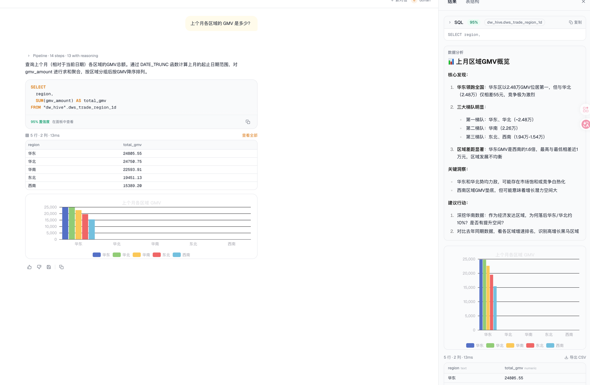
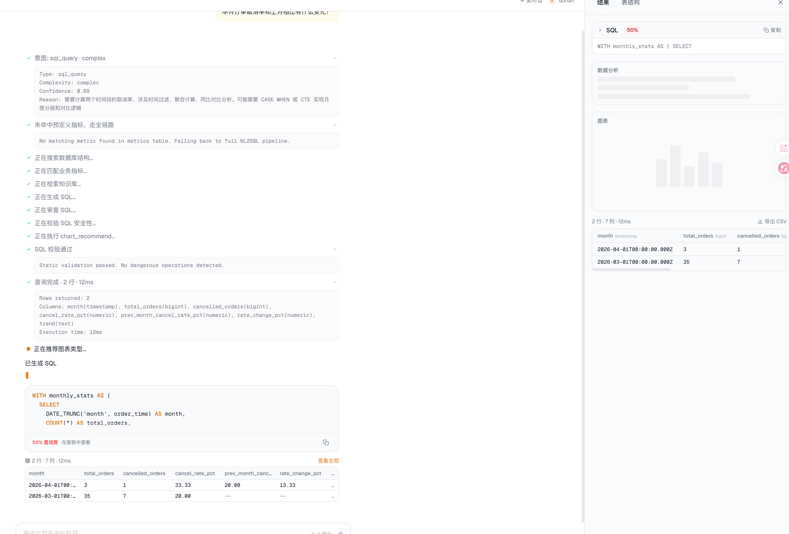
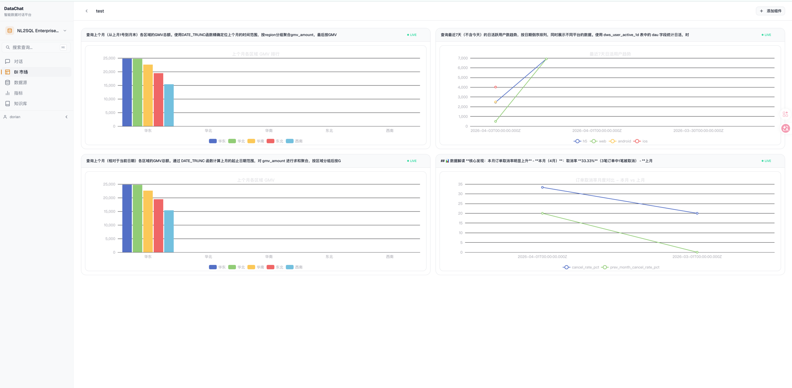

# DataChat — 智能数据对话平台

用自然语言对话探索数据，AI 驱动查询、图表与洞察。



## Features

- **Natural Language to SQL** — 输入自然语言问题，AI 自动生成 SQL 并执行，返回数据表格、图表和洞察分析
- **Pipeline Transparency** — ChatGPT 风格的 reasoning 展示，每一步（意图分类、Schema Linking、SQL 生成、验证）都可展开查看思考过程
- **Smart Charts** — LLM 自动推荐最佳图表类型（柱状图、折线图、饼图、散点图等 10 种），带验证评分
- **Data Insight** — SQL 执行后自动生成数据解读，结构化 Markdown 呈现核心发现和行动建议
- **Conversation History** — 多轮对话，上下文关联，侧边栏管理历史对话
- **BI Dashboard** — 将查询结果保存为组件，组装成可视化仪表盘



## Architecture

```
packages/
├── web/        Next.js 16 + React 19 + Tailwind 4 + shadcn/ui
├── api/        Koa.js + SSE streaming
├── engine/     NL2SQL pipeline (Claude API)
├── db/         Drizzle ORM + PostgreSQL + pgvector
└── shared/     Shared types
```

### NL2SQL Pipeline

```
User Query
  → Intent Classification (sql_query / follow_up / off_topic)
  → Metric Resolution (fast path for predefined metrics)
  → Query Decomposition (complex → sub-queries)
  → Schema Linking (pgvector embedding recall + LLM rerank)
  → Knowledge RAG + Few-shot Retrieval
  → SQL Generation (with schema prefix + glossary)
  → Table Name Validation (anti-hallucination guard)
  → Dual-stage Verification (ANTLR4 static + LLM 5-dim scoring)
  → SQL Execution → Chart Recommendation → Data Insight
```

### Data Layer

- **5 Engine-type Datasources**: Hive / Iceberg / Spark / MySQL / Doris
- **DW Layered Tables**: ODS → DWD → DWS → DIM → ADS
- **pgvector Embeddings**: Schema columns + knowledge docs + glossary for RAG retrieval



## Getting Started

### Prerequisites

- Node.js >= 22
- PostgreSQL 16 with pgvector extension
- pnpm

### Setup

```bash
# Install dependencies
pnpm install

# Configure environment
cp .env.example .env
# Edit .env with your DATABASE_URL and ANTHROPIC_API_KEY

# Run migrations
pnpm db:migrate

# Seed sample data (5 datasources, 290 tables, 90+ metrics)
pnpm db:seed

# Start development
pnpm dev:api   # API server on :3100
WATCHPACK_POLLING=true pnpm dev:web  # Web on :3000
```

### Deployment

```bash
pnpm build
# Uses ecosystem.config.cjs for PM2 process management
# Nginx reverse proxy → PM2 apps
```

## Tech Stack

| Layer | Stack |
|-------|-------|
| Frontend | Next.js 16, React 19, Tailwind 4, Zustand, ECharts, Monaco Editor |
| Backend | Koa.js, SSE (Server-Sent Events), Zod validation |
| AI Engine | Claude API (Sonnet for generation, Haiku for classification) |
| Database | PostgreSQL 16 + pgvector (1536-dim embeddings) |
| ORM | Drizzle ORM with typed schema |
| SQL Validation | ANTLR4 parser (static) + LLM 5-dimension scoring (semantic) |

## License

Private project.
